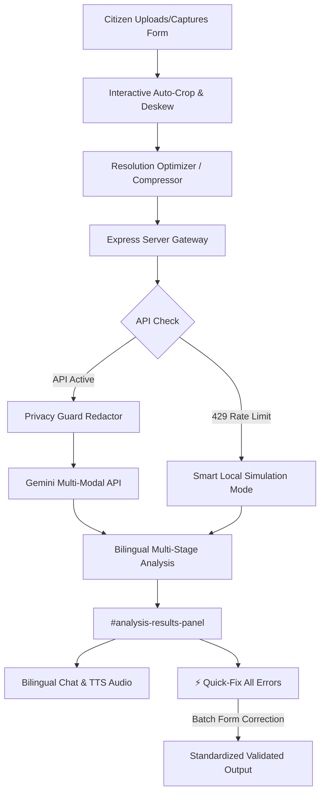

<div align="center">


</div>

---

## 📌 Overview

**Form-Fixer** is a privacy-first, high-performance national document completeness & bilingual self-correction portal designed to empower citizens of India/Bharat to successfully navigate, fill, and self-correct government service application forms.

Instead of facing high rejection rates at civic centers (e.g., Aadhaar Kendras, RTO offices) due to missing signatures, blank fields, or incorrect formatting, citizens can scan their document and immediately receive real-time, step-by-step guidance.

The system combines four layers of document optimization and validation:
- **Client-Side Workspace** — provides contrast edge scanning, rotational deskewing, crop reticles, and multi-pass resolution optimization.
- **AI-Powered Analysis** — automatically identifies missing signatures, incomplete blocks, and incorrect formats.
- **Smart Local Simulation (Offline Fallback)** — guarantees 100% up-time and flawless testing by automatically initiating high-fidelity offline document analysis when Gemini API limits or quota blocks (429 errors) are reached.
- **⚡ Batch Quick-Fix** — allows citizens to instantly auto-correct all missing or incorrect fields with standardized compliance formats tailored specifically for standard Indian national IDs and certificates.

---

## ✨ Features

### 🔌 Client-Side Workspace & Imaging Engine
| | Feature | Details |
|---|---|---|
| 📐 | Contrast Edge Scan | Canvas analyzes pixel luminance to detect document boundaries against backgrounds |
| 🔄 | Rotational Deskew | Quick 90° rotation controls to align landscape/portrait images instantly |
| ✂️ | Multi-Aspect Cropping | Snaps selection to standard card sizes (Aadhaar, PAN, Voter ID) or standard A4 pages |
| 📉 | Smart Compression | Multi-pass compression & resolution optimizer ensures files fit under API size limits |

### 🧠 Backend Gateway & AI Analysis
| | Feature | Details |
|---|---|---|
| 🛡️ | Privacy Guard Redactor | Redacts Aadhaar, PAN, and contact numbers from OCR streams before any AI processing |
| 💬 | Bilingual Companion | Contextual Q&A helper supporting English, Hindi, and dynamic Hinglish code-switching |
| 🗣️ | Dual-Language Speech | Web Speech API text-to-speech voice playbacks in both English and Hindi accents |
| ⚖️ | 6-Stage Pipeline | Tracks user document status seamlessly from Upload, Crop, Redact, Scan, Action, to Submit |

### ⚡ Batch Quick-Fix & Smart Simulation (New!)
| | Feature | Details |
|---|---|---|
| ⚡ | Batch Auto-Correction | Click-to-fix all MISSING or INCORRECT checklist fields with standardized formatting |
| 🤖 | Document-Specific Presets | Custom rule-based correction templates for Aadhaar Cards, PAN Cards, and Driving Licenses |
| 💡 | Smart Local Simulation | Zero-downtime fallback to high-fidelity simulated models when Gemini API returns 429 quota errors |
| 💬 | Offline Chat Responder | Intelligent, context-aware rule-based conversation engine for offline or rate-limited sessions |

---

## 🧱 System Architecture



### Components

- **Client Workspace** (`src/components/AutoCropModal.tsx`) — handles canvas-based boundary detection, crop overlays, rotational deskewing, and image optimizations.
- **Core State Orchestrator** (`src/App.tsx`) — manages the full 6-stage lifecycle, the smart local fallbacks, the batch auto-correction, and the main interactive dashboard.
- **AI Vision Client** (`src/geminiClient.ts`) — connects to the server gateway to run multi-modal form checklist validation.
- **Express Server Gateway** (`server.ts`) — handles proxying API requests safely, securing keys, and executing the production bundle.

---

## 📂 Project Structure

```
Form-Fixer/
├── server.ts                   # Full-Stack Express Server (API Proxy + Vite Middleware)
├── package.json                # Project dependency manifest and compilation scripts
├── tsconfig.json               # TypeScript compiler rules
├── vite.config.ts              # Vite asset pipelines and Tailwind integrations
├── metadata.json               # Frame permissions and major applet metadata
├── .env.example                # Blueprint for local secret credentials
├── .gitignore                  # Prevents caching of node_modules and builds
│
└── src/                        # Client-Side Codebase
    ├── main.tsx                # Client bootstrapper
    ├── index.css               # Global Tailwind CSS directives and font face bindings
    ├── geminiClient.ts         # High-level server-side LLM connection client configurations
    ├── App.tsx                 # Core parent React component containing state routing
    │
    ├── assets/                 # Brand design files
    │   └── images/
    │       └── form_fixer_logo_1784189901251.jpg
    │
    └── components/             # Reusable UI Modules
        └── AutoCropModal.tsx   # Canvas-based Auto-Cropping & Boundary Alignment Workspace
```

---

## 🛠️ Technology Stack

<table>
<tr><td valign="top"><b>Frontend UI</b></td><td>

- React 18+, TypeScript, Tailwind CSS, Framer Motion
- Fluid layouts, 3D card tilts, micro-animations, and responsive density metrics

</td></tr>
<tr><td valign="top"><b>Client Workspace</b></td><td>

- HTML5 Canvas Engine for high-speed crop reticle overlays and pixels analyzes
- Web Speech API (TTS) for high-fidelity speech playbacks in English and Hindi

</td></tr>
<tr><td valign="top"><b>Backend Server</b></td><td>

- Node.js, Express, tsx (dev-runner), esbuild
- Secure proxy routing for Gemini multi-modal scanning API key protection

</td></tr>
<tr><td valign="top"><b>AI Engine & NLP</b></td><td>

- Google Gemini 2.5 Flash / Pro via the modern `@google/genai` SDK
- Multilingual OCR, structural checklist classification, and dynamic Hinglish code-switching

</td></tr>
</table>

---

## ⚙️ Installation & Setup

### 🔹 Clone & Setup

```bash
# 1. Install dependencies
npm install

# 2. Configure environment variables
# Create a .env file in the project root:
# GEMINI_API_KEY=your_gemini_api_key_here

# 3. Run in Development Mode
npm run dev
```

### 🔹 Production Compilation

```bash
# Compile and bundle for production
npm run build

# Start the production bundle
npm start
```

---

## 🏛️ Supported Civic Forms
* **UIDAI Aadhaar Cards** (Enrollment / Corrections / Demographic Updates)
* **Income Tax Department PAN Cards** (Form 49A)
* **Ministry of Road Transport & Highways Driving License** (Form 4)
* **Ministry of External Affairs Passports** (Fresh / Re-issue Form 1)
* **Election Commission of India Voter ID Cards** (Form 6 / Correction Form 8)
* **Ayushman Bharat Golden Card** (National Health Registrations)

---

## 📜 License

This project is licensed under the **MIT License**.

---

<div align="center">
<h3>🔥 "Form-Fixer – Elevating Indian Digital Governance."</h3>
</div>
